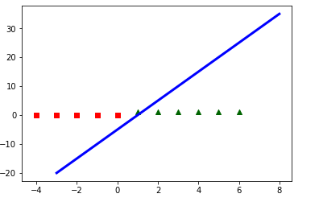
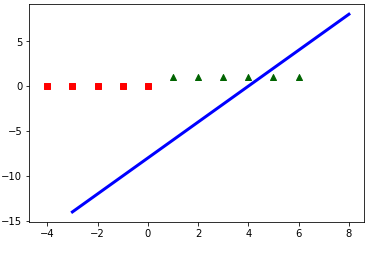

## Perceptron Learning
Basic perceptron learning using delta rule is demonstrated using line plot. Following line plot depicts
the initial and final state of the classifier line as drawn using the initial and updated weight.

   

## Dependencies
* Python3

## Reference
[1]. Russell, Ingrid. "The delta rule." University of Hartford, West Hartford(2012).
